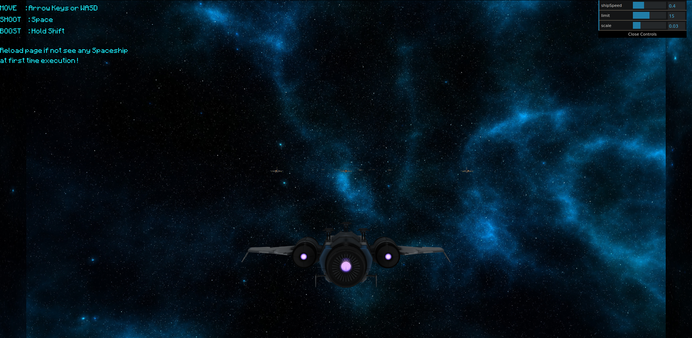

# 3D Démo -- Shoot'em up (Space Shooter)

Une démo sur le thème de la détection de collision avec le moteur de jeu JavaScript en 3D (Three.js)



------

A demo on the topic of collision detection with the game engine JavaScript : [Shoot'em up](https://en.wikipedia.org/wiki/Shoot_'em_up)


Assets:
- [Spaceship_cb1](https://sketchfab.com/3d-models/spaceship-cb1-4a8fddf9fadf4d2998925ca4b6d4b93b)


Run :
```
python3 -m http.server 5500
```


_**Viet Nguyen 20006303**_

