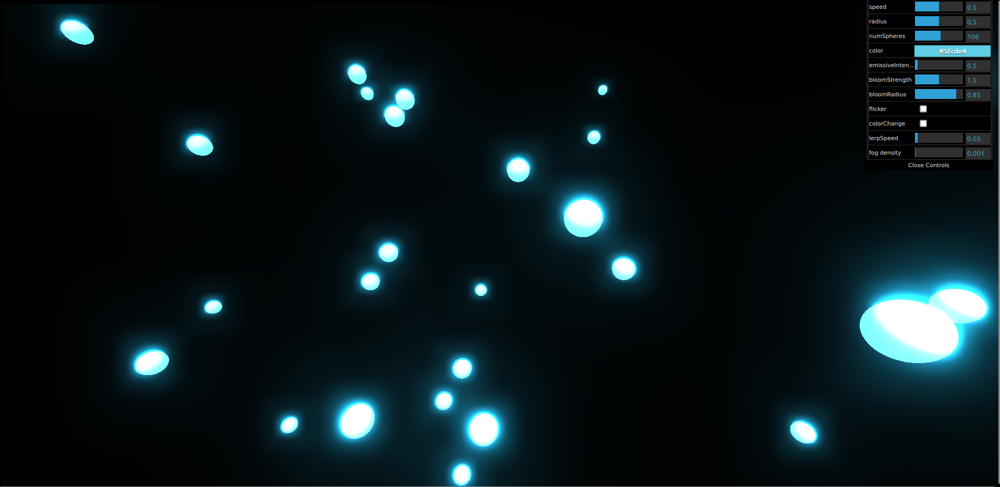

# 3D Demo -- Beautiful Animation (Fireflies & Effects)

A demo on graphic effects and pretty animated in 3D with the 3D JavaScript game engine (Three.js)




To run it, enter this command in this démo folder path :
``` 
python3 -m http.server 5501 
```

--------

# 3D Démo -- Jolie Animée (Lucioles & Effets)

Une démo sur le graphique effets et jolie animée en 3D avec le moteur de jeu JavaScript en 3D (Three.js)


### Sources d'importer des bibliothèques

- [three.js version 0.153.0](https://unpkg.com/browse/three@0.153.0/build/three.module.js) sur [unpkg.com](https://unpkg.com/): https://unpkg.com/three@0.153.0/

  - [OrbitControls.js](https://unpkg.com/browse/three@0.153.0/examples/jsm/controls/OrbitControls.js) de contrôler le camera avec souris.
  - [EffectComposer.js](https://unpkg.com/browse/three@0.153.0/examples/jsm/postprocessing/EffectComposer.js)
  - [RenderPass.js](https://unpkg.com/browse/three@0.153.0/examples/jsm/postprocessing/RenderPass.js)
  - [UnrealBloomPass.js](https://unpkg.com/browse/three@0.153.0/examples/jsm/postprocessing/UnrealBloomPass.js) de effectue une couverture lumineuse autour de l'objets.

- [simplex-noise.js](https://github.com/jwagner/simplex-noise.js/blob/main/simplex-noise.ts) sur github : https://github.com/jwagner/simplex-noise.js

- [dat.gui.js](https://github.com/dataarts/dat.gui/blob/master/build/dat.gui.js) sur github : https://github.com/dataarts/dat.gui


Auteur: _Viet NGUYEN 20006303_
