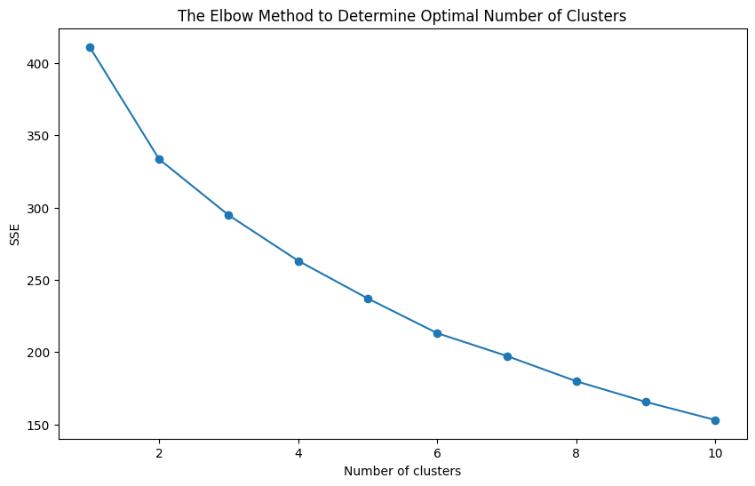
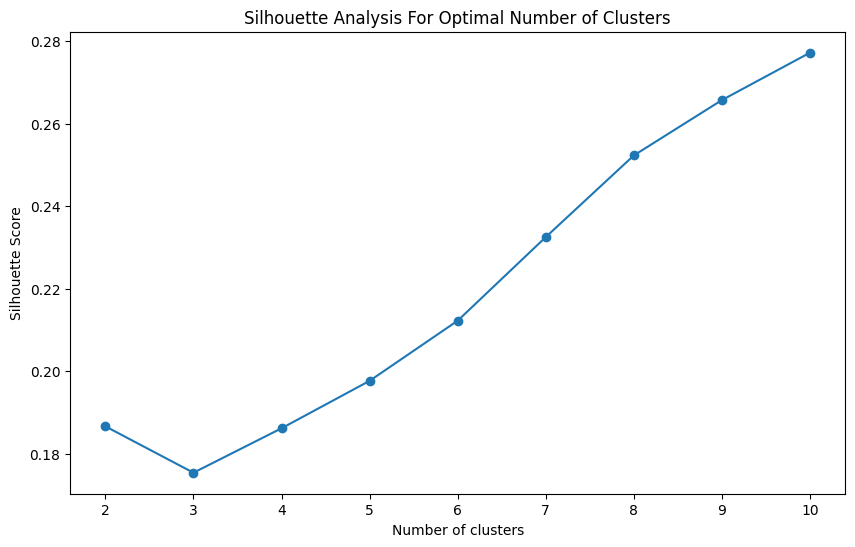
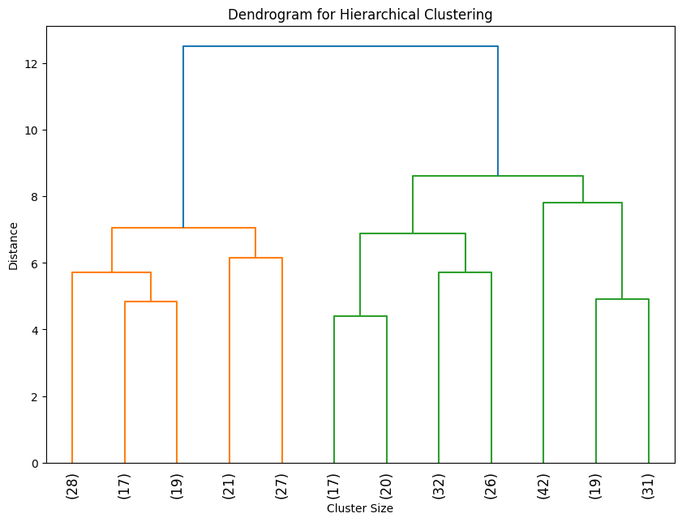

# Clustering de données réelles, comparaison, évaluation et explications

Rapport de projet réalisé par __Viet Nguyen -- 20006303 -- L3Y__.

## I) <ins>Introduction</ins>

### 1) Objectif et Contexte

Ce projet vise à explorer et à comparer différents algorithmes de clustering sur un ensemble de données cliniques de défaillance cardiaque. L'objectif est de déterminer le nombre de clusters optimal et d'évaluer la qualité des clusters générés par chaque algorithme.

Ce projet repose sur le fichier notebook Jupyter `heart_failure.ipynb`, qui exécute chaque ligne de code en Python et affiche immédiatement les résultats dans le notebook.
Le fichier `heart_failure.py` est le script Python utilisé pour vérifier les fonctions dans `heart_failure.ipynb`.


### 2) Source de données

Source de donnée : [Heart Failure Clinical Records](https://www.kaggle.com/datasets/rabieelkharoua/predict-survival-of-patients-with-heart-failure?resource=download)


## II) <ins>Méthodologie</ins>

### 1) Préparation des Données

- Les données ont été normalisées à l'aide d'un scaling Min-Max pour garantir une contribution égale de chaque attribut dans le processus de clustering. Utilisation de la bibliotheque `pandas` pour le traitement des données.

```python
import pandas as pd
data = pd.read_csv('heart_failure_clinical_records_dataset.csv')
data.head()
```

- La colonne `DEATH_EVENT` a été supprimée car elle n'était pas pertinente pour l'analyse de clustering. Les données sont normalisées à l'aide d'un scaling Min-Max pour garantir une contribution égale de chaque attribut dans le processus de clustering.

```python
def min_max_scaling(df):
	for column in df.columns:
		min_col = df[column].min()
		max_col = df[column].max()
		df[column] = (df[column] - min_col) / (max_col - min_col)
	return df

data_scaled = min_max_scaling(data.drop(['DEATH_EVENT'], axis=1))
data_scaled.head()
```

### 2) Algorithmes Utilisés

Les algorithmes suivants ont été utilisés :

- K-Means
- Clustering Hiérarchique
- DBSCAN
- Mean Shift
- Clustering Spectral
- Clustering Agglomératif

### 3) Recherche du Nombre Optimal de Clusters

- **`K-Means` : Utilisation de la méthode du coude (Elbow Method) et de l'analyse Silhouette**
	- **Méthode du Coude** : Le nombre de clusters optimal est déterminé en traçant la somme des erreurs quadratiques (SSE) pour différentes valeurs de k et en trouvant le point où l'amélioration commence à diminuer.

	```python
	import matplotlib.pyplot as plt
	from sklearn.cluster import KMeans

	def find_optimal_clusters_kmeans(data, max_k):
		sse = []
		for k in range(1, max_k+1):
			kmeans = KMeans(n_clusters=k, random_state=42)
			kmeans.fit(data)
			sse.append(kmeans.inertia_)
		plt.figure(figsize=(10, 6))
		plt.plot(range(1, max_k+1), sse, 'bx-')
		plt.xlabel('Nombre de clusters')
		plt.ylabel('SSE')
		plt.title('Méthode du Coude pour Déterminer le Nombre Optimal de Clusters')
		plt.show()

	find_optimal_clusters_kmeans(data_scaled, 10)
	```
	

	- **Analyse Silhouette** : Cette méthode évalue la qualité des clusters en fonction de la cohésion et de la séparation.

	```python
	from sklearn.metrics import silhouette_score

	def silhouette_analysis(data, max_k):
		silhouette_scores = []
		for k in range(2, max_k+1):
			kmeans = KMeans(n_clusters=k, random_state=42)
			labels = kmeans.fit_predict(data)
			score = silhouette_score(data, labels)
			silhouette_scores.append(score)
		plt.figure(figsize=(10, 6))
		plt.plot(range(2, max_k+1), silhouette_scores, 'bx-')
		plt.xlabel('Nombre de clusters')
		plt.ylabel('Silhouette Score')
		plt.title('Analyse Silhouette pour Déterminer le Nombre Optimal de Clusters')
		plt.show()

	silhouette_analysis(data_scaled, 10)
	```
	

- **`Clustering Hiérarchique` : Utilisation du dendrogramme pour déterminer le nombre de clusters**
	- **Dendrogramme** : Le nombre de clusters est déterminé en coupant le dendrogramme à un certain niveau.

	```python
	from scipy.cluster.hierarchy import dendrogram, linkage

	def plot_dendrogram(data):
		linked = linkage(data, method='ward')
		plt.figure(figsize=(10, 7))
		dendrogram(linked, orientation='top', distance_sort='descending', show_leaf_counts=True)
		plt.title('Dendrogramme pour Clustering Hiérarchique')
		plt.show()

	plot_dendrogram(data_scaled)
	```
	

- **`DBSCAN` : Ajustement des paramètres `eps` et `min_samples` pour optimiser le clustering**
	- **Recherche des paramètres optimaux** : La méthode `DBSCAN` est sensible aux paramètres `eps` et `min_samples`, qui doivent être ajustés pour obtenir le meilleur clustering.

	```python
	from sklearn.cluster import DBSCAN
	from sklearn.metrics import silhouette_score

	def tune_dbscan(data, eps_range, min_samples_range):
		best_score = -1
		best_eps = None
		best_min_samples = None
		
		for eps in eps_range:
			for min_samples in min_samples_range:
				dbscan = DBSCAN(eps=eps, min_samples=min_samples)
				labels = dbscan.fit_predict(data)
				if len(set(labels)) > 1:
					score = silhouette_score(data, labels)
					if score > best_score:
						best_score = score
						best_eps = eps
						best_min_samples = min_samples
		return best_eps, best_min_samples, best_score

	eps_range = np.arange(0.1, 1.0, 0.1)
	min_samples_range = range(2, 10)
	best_eps, best_min_samples, best_score = tune_dbscan(data_scaled, eps_range, min_samples_range)
	print("Meilleur eps:", best_eps, "Meilleur min_samples:", best_min_samples, "Meilleur Silhouette Score:", best_score)
	```
	```bash
	Meilleur eps: 0.8 Meilleur min_samples: 2 Meilleur Silhouette Score: 0.4638464782642073
	```

- **`Mean Shift` : Estimation de la bande passante optimale pour déterminer le nombre de clusters**
	- **Recherche de la bande passante optimale** : `Mean Shift` détermine les clusters en fonction de la densité des points de données.

	```python
	from sklearn.cluster import MeanShift, estimate_bandwidth

	def apply_mean_shift(data):
		bandwidth = estimate_bandwidth(data)
		mean_shift = MeanShift(bandwidth=bandwidth)
		labels = mean_shift.fit_predict(data)
		num_clusters = len(np.unique(labels))
		return num_clusters, labels

	num_clusters, labels = apply_mean_shift(data_scaled)
	print("Nombre de clusters trouvés:", num_clusters)
	```

- **`Clustering Spectral` et `Clustering Agglomératif` : Utilisation de l'analyse Silhouette**
	- **Recherche du nombre optimal de clusters** : Utilisation de la méthode Silhouette pour ces deux algorithmes.

	```python
	def find_optimal_clusters_silhouette(data, algorithm_class, max_clusters=10):
		scores = []
		for k in range(2, max_clusters + 1):
			model = algorithm_class(n_clusters=k)
			clusters = model.fit_predict(data)
			score = silhouette_score(data, clusters)
			scores.append(score)
		plt.figure(figsize=(8, 6))
		plt.plot(range(2, max_clusters + 1), scores, marker='o')
		plt.title('Silhouette Score pour Nombre Optimal de Clusters')
		plt.xlabel('Nombre de clusters')
		plt.ylabel('Silhouette Score')
		plt.show()

	find_optimal_clusters_silhouette(data_scaled, SpectralClustering)
	find_optimal_clusters_silhouette(data_scaled, AgglomerativeClustering)
	```


### 4) Évaluation des Algorithmes

- Comparaison des algorithmes pour la sélection du nombre optimal de clusters.

| Algorithme              | Silhouette Score | Indice Davies-Bouldin | Indice Calinski-Harabasz |
|-------------------------|------------------|-----------------------|--------------------------|
| K-Means                 | 0.232468         | 1.476832              | 52.793230                |
| Clustering Hiérarchique | 0.212983         | 1.447152              | 52.406199                |
| DBSCAN                  | 0.463846         | 1.323506              | 61.309896                |
| Mean Shift              | NaN              | NaN                   | NaN                      |
| Clustering Spectral     | 0.229557         | 1.312351              | 47.433587                |
| Clustering Agglomératif | 0.279012         | 1.315565              | 54.043990                |


- Évaluation des algorithmes pour la sélection des clusters génériés par chaque algorithme.

	- `DBSCAN` s'est avéré être l'algorithme le plus performant avec le meilleur score Silhouette et l'indice de Davies-Bouldin le plus bas, indiquant des clusters bien définis.
	- `Clustering Agglomératif` a également montré des résultats satisfaisants.
	- `K-Means` et `Clustering Spectral` ont montré des performances raisonnables mais inférieures à `DBSCAN`.
	- `Mean Shift` n'a pas généré de résultats valides avec les paramètres utilisés, suggérant un besoin de révision des paramètres de bande passante.

==> `DBSCAN` est recommandé pour ce type de données en raison de sa capacité à gérer les densités de clusters variables et à identifier les points de bruit.


## III) <ins>Visualisation des Clusters</ins>

Pour mieux comprendre les résultats des différents algorithmes de clustering, des visualisations ont été créées en utilisant la PCA (analyse en composantes principales) et t-SNE (embedding stochastique t-distribué).

### PCA (Analyse en Composantes Principales)

```python
from sklearn.decomposition import PCA
import matplotlib.pyplot as plt

# Réduire les données à 2 dimensions en utilisant PCA
pca = PCA(n_components=2)
data_pca = pca.fit_transform(data_scaled)

def plot_clusters(data, labels, title):
	plt.figure(figsize=(10, 6))
	unique_labels = np.unique(labels)
	for label in unique_labels:
		plt.scatter(data[labels == label, 0], data[labels == label, 1], label=f'Cluster {label}')
	plt.title(title)
	plt.xlabel('Composante principale 1')
	plt.ylabel('Composante principale 2')
	plt.legend()
	plt.show()

# Visualiser chaque résultat de clustering
plot_clusters(data_pca, kmeans_labels_optimal, 'K-Means Clustering')
plot_clusters(data_pca, hierarchical_labels_optimal, 'Hierarchical Clustering')
plot_clusters(data_pca, dbscan_labels_optimal, 'DBSCAN Clustering')
plot_clusters(data_pca, mean_shift_labels_optimal, 'Mean Shift Clustering')
plot_clusters(data_pca, spectral_labels_optimal, 'Spectral Clustering')
plot_clusters(data_pca, agglomerative_labels_optimal, 'Agglomerative Clustering')
```

### T-SNE (Embedding Stochastique t-Distribué)

```python
from sklearn.manifold import TSNE

# Réduire les données à 2 dimensions en utilisant t-SNE
tsne = TSNE(n_components=2, random_state=42)
data_tsne = tsne.fit_transform(data_scaled)

# Visualiser chaque résultat de clustering avec t-SNE
plot_clusters(data_tsne, kmeans_labels_optimal, 'K-Means Clustering (t-SNE)')
plot_clusters(data_tsne, hierarchical_labels_optimal, 'Hierarchical Clustering (t-SNE)')
plot_clusters(data_tsne, dbscan_labels_optimal, 'DBSCAN Clustering (t-SNE)')
plot_clusters(data_tsne, mean_shift_labels_optimal, 'Mean Shift Clustering (t-SNE)')
plot_clusters(data_tsne, spectral_labels_optimal, 'Spectral Clustering (t-SNE)')
plot_clusters(data_tsne, agglomerative_labels_optimal, 'Agglomerative Clustering (t-SNE)')
```

## IV) <ins>Conclusion</ins>

### 1) Résumé des Découvertes

Ce projet a démontré l'efficacité des algorithmes de clustering, en particulier `DBSCAN`, dans l'analyse des données cliniques de défaillance cardiaque. Les analyses ont permis de déterminer des clusters distincts, offrant des perspectives précieuses pour de futures études et applications cliniques.

### 2) Limitations et Perspectives Futures

- Une exploration plus approfondie des paramètres pour les algorithmes de clustering non optimaux pourrait améliorer les résultats.
- Intégrer des méthodes supplémentaires de validation des clusters pour renforcer la robustesse des conclusions.

