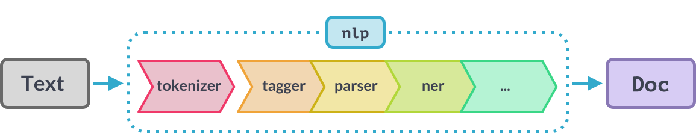

# TP 2 : nombre moyen de mots par phrase et profilage morphosyntaxique

**Objectif**
On souhaite récupérer pour un.e auteur.ice le nombre moyen de mots par phrase, puis représenter un document par la répartition des catégories grammaticales des mots qui le composent.

**Pourquoi ?** On a parfois besoin de développer ou d'adapter depuis l'existant de nouveaux outils de segmentation pour une tâche spécifique ou un corpus spécifique (texte issu de twitter, de conversations, poésie du XVIIè siècle, oral transcrit, etc.).

**Fichiers de test**
En français, commencez par tester votre programme sur le fichier `conte.txt`. Des "tests" additionnels sont renseignés en fin d'énoncé. Si vous pensez à d'autres tests, partagez-les.
Attention, si vous décidez de ne pas faire l'exercice en français, vous devez utiliser des textes de test pour votre programme qui inclut tout de même des guillemets, différentes ponctuations, etc. afin de pouvoir illustrer le fonctionnement de votre programme.

	Attendus
	Dans un fichier README, vous présentez les différentes méthodes testées, 
	donnez vos commentaires sur les output obtenus, 
	et indiquez le temps d'exécution de chacune des méthodes 
	(par exemple en utilisant la commande bash `time`)

	Produisez du code modulaire autant que possible : 
	vous allez devoir à plusieurs reprises ouvrir, 
	écrire et fermer des fichiers, 
	utilisez a minima des fonctions pour ne pas rendre de code redondant.


:question: Quelles sont les étapes principales à réaliser pour atteindre l'objectif ?

> Details
> [1. découper le texte en phrases](#1-découpage-en-phrases--test-de-différentes-méthodes)
> [2. découper le texte en mots](#2-découpage-en-mots--test-de-différentes-méthodes)
> [3. annoter en catégories grammaticales les mots du texte](#3-annotation-morphosyntaxique)
> [4. choisir un format de représentation](#4-utilisation)


## 1. Découpage en phrases : test de différentes méthodes

Dans cette section vous devez dans les 3 cas produire un programme qui découpe en phrases le texte d'un fichier `input.txt` et crée un fichier xml `output.xml` découpé en phrases de la forme :
```xml
<?xml version="1.0" encoding="utf-8"?>
<text>
<sent id='0'>Le caillou qui voulait voir le monde - Conte pour enfant
</sent>
<sent id='1'>Par Sabine D'Halluin
</sent>
<sent id='2'>C’est l’histoire d’un petit caillou au bord d’un chemin.</sent>
<sent id='3'> Un chemin de campagne.</sent>
```

### 1.1 La méthode "à base de règles"

Pour cet exercice, seules les expressions régulières sont autorisées (pas de librairie dédiée au découpage), vous pouvez utiliser le langage de votre choix.

Pour python :

- [module re](https://docs.python.org/3/howto/regex.html)
- [howto regex](https://docs.python.org/3/howto/regex.html)
- [I/O (read et write)](https://docs.python.org/3/tutorial/inputoutput.html)


### 1.2 Utilisation de librairies dédiées (python)

1. `Sentencizer`

Il existe un certain nombre de librairies permettant de faire des traitements sur la langue. Attention, toutes les librairies n'existent pas pour toutes les langues ni avec les mêmes performances.

Utilisez le composant "sentencizer" de la méthode `add_pipe` du module `French` de `spacy.lang.fr` pour proposer une autre solution.
[composant Sentencizer Spacy](https://spacy.io/api/sentencizer)

2. `Senter`
	Rappel pipeline spacy :

source : https://spacy.io/api

[Documentation pipeline nlp](https://spacy.io/usage/processing-pipelines) : la méthode nlp fait l'ensemble des traitements ci-dessus grâce au composants listés ici : [composants](https://spacy.io/usage/processing-pipelines#built-in), et crée un objet **Doc** comme illustré ci-dessus.
Pour accéder aux annotations produites par chaque module, consultez la documentation correspondante : par exemple, les entités sont accessibles via **Doc.ents** (voir [documentation entity recognizer (ner)](https://spacy.io/api/entityrecognizer)).

__:warning: Ce n'est pas parce qu'une librairie existe 
et est joliment présentée qu'elle produit un résultat systématiquement correct.
ex : [performances annoncées de chaque module (français)](https://spacy.io/models/fr#fr_core_news_sm-accuracy)__

Utilisez le 'senter' d'un modèle de langue tel que fr_core_news_sm pour proposer une troisième solution : [Senter Spacy](https://spacy.io/api/sentencerecognizer).

## 2. Découpage en mots : test de différentes méthodes

Le découpage en mots est une tâche facile en apparence et dont la difficulté varie largement selon les langues.
Les `choix` faits lors de cette étape vont avoir une influence à l'étape suivante, c'est-à-dire sur une "`downstream task`".

Si le segment `c'est-à-dire` n'est pas découpé, alors il est considéré comme un adverbe : `c'est-à-dire/ADV`
S'il est découpé, on peut se retrouver avec `c'/PRON` `-/PUNCT` `est/VERB` `-/PUNCT` `à/ADP` `-/PUNCT` `dire/VERB`.

Les choix qui sont fait peuvent à peu près toujours être justifiés. L'important est de les documenter, pour savoir à quoi s'attendre quand on utilise un outil. En première approximation, on peut se dire que si un mot existe dans le dictionnaire en tant que tel (par exemple [c'est-à-dire](https://www.larousse.fr/dictionnaires/francais/c_est-%C3%A0-dire/14350), alors on considère que c'est un `token` à part entière.

### 2.1 Tokéniseur "à base de règles"

Commencez par observer le résultat du découpage "selon les espaces". Améliorez ce résultat en incluant à votre tokéniseur les ponctuations et tout ce qui vous paraît nécessaire pour tokéniser correctement le texte suivant :


	Depuis huit jours, j’avais déchiré mes bottines
	Aux cailloux des chemins. J’entrais à Charleroi.
	– Au Cabaret-Vert : je demandai des tartines
	De beurre et du jambon qui fût à moitié froid.
[Au Cabaret-Vert, cinq heures du soir - Arthur Rimbaud](https://fr.wikisource.org/wiki/Po%C3%A9sies_(Rimbaud)/%C3%A9d._Vanier,_1895/Au_Cabaret-Vert,_cinq_heures_du_soir)


### 2.2 Librairie NLTK (Natural Language ToolKit)

Dans un premier temps, téléchargez le module 'punkt' de la librairie nltk :

```bash
$ python
>>> import nltk
>>> nltk.download('punkt') 
```

puis testez le code suivant :

```python
import nltk

from nltk.tag import StanfordPOSTagger
from textblob import TextBlob

# Le chemin est à spécifier selon la localisation du
# module punkt
tokenizer = nltk.data.load('##TO CHANGE##/punkt/french.pickle')
words_generator = tokenizer._tokenize_words("Depuis huit jours, j'avais déchiré mes bottines Aux cailloux des chemins. J'entrais à Charleroi. - Au Cabaret-Vert : je demandai des tartines De beurre et du jambon qui fût à moitié froid.")
words = [word for word in words_generator]
```

Que pensez-vous du résultat ?


### 2.2 Tokéniseur SpaCy

Le fonctionnement du tokéniseur de la pipeline Spacy est expliqué ici : [documentation](https://spacy.io/usage/linguistic-features#tokenization)
Utilisez la documentation de spacy pour tokéniser votre texte d'une seconde manière [documentation](https://spacy.io/usage/spacy-101).

Prêtez attention à ce que vous avez gagné/perdu par rapport à la méthode précédente.

### 2.3 Remarque et tokéniseur custom

Il parfois utile de combiner plusieurs outils en cascade en fonction de vos besoins. Par exemple, testez d'ajouter un "#IDL" dans une chaîne de texte à tokéniser : il y a de fortes chances que vous vous retrouviez avec le caractère `#` séparé de `IDL`. Pour une application où vous souhaitez considérer que les hashtags doivent être regroupés, vous pouvez customiser votre tokéniseur ou faire une seconde passe qui regroupe le signe `#` et le token qui suit.

Les tokéniseurs ci-dessus ne sont pas complètement satisfaisants. Vous aurez besoin d'un outil pour votre projet, donc gardez en tête les qualités et les défauts éventuels des outils existants, quitte à améliorer leur sortie pour vos besoins.

Utilisez l'outil (ou la combinaison d'outils) de votre choix et produisez à partir du document `conte.txt` un nouveau fichier xml où chaque phrase est entourée des balises `<sentence></sentence>` et chaque mot est entouré des balises `<mot></mot>`.

## 3. Annotation morphosyntaxique

Si vous avez bien lu la documentation de SpaCy, vous avez dû voir que la pipeline `nlp` produit aussi les annotations morphosyntaxiques accessibles via `token.pos_`. Ajoutez cette information sous la forme qui vous semble le plus pratique (nouvel élément ? attribut ?) dans le fichier xml contenant les phrases et les mots tokénisés.

Quelles sont les performances annoncées par SpaCy pour ce module ? Détectez-vous des erreurs ?


## 4. Utilisation

1. Utilisez vos programmes pour comparer le nombre moyen de mots par phrases chez deux auteurs/trices de votre choix.

2. Proposez une visualisation de vos deux corpus (cela peut être simplement un texte de chaque auteur/trice) selon par exemple leur proportion respective de chaque catégorie grammaticale, les mots les plus fréquents pour chaque auteur/trice, etc.
Vous pouvez utiliser XSL pour mettre en forme votre XML ou bien les librairies de votre choix pour produire un affichage permettant de faire une comparaison.


### Tests de vos programmes

- Sur https://pablockchain.fr retrouvez mes conférences (captation 🎬 & dates 📆), billets de blog 📝 et articles scientifiques 📰 au sujet des #blockchains #cryptomonnaies #NFT #web3… 📮Vous pouvez m'y laisser votre mail pour être informé·e de mes futures interventions 😊." ([ici](https://twitter.com/p4bl0/status/1708175577251786954))
- M. Revault d'Allonnes est joignable par mail à l'adresse : ara@up8.edu ou au +33 0149406497.
- testez sur un très long texte (par exemple généré par [ipsum.one](https://ipsum.one/fr/paragraphes/50))


## Installations

  - installation package Spacy :


```
apt update
apt install python3-pip
pip install spacy
```


 - (éventuellement) installation de PyCharm ou d'un éditeur qui vous permet d'accéder facilement à la `documentation` des différentes fonctions.
	téléchargement du "modèle de langue" du français

```
python3 -m spacy download fr_core_news_sm
```