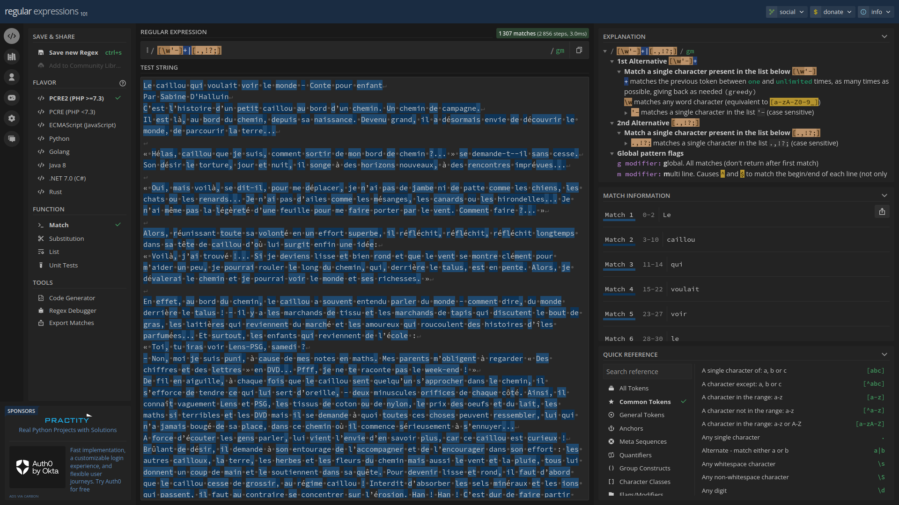
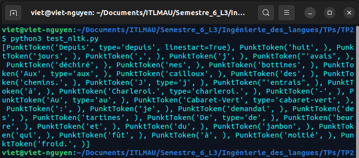

# TP 2 : nombre moyen de mots par phrase et profilage morphosyntaxique

Rapport de TP réalisé par __Viet Nguyen -- 20006303__.

__________________________________________________

## 1. Découpage en phrases : test de différentes méthodes

Dans cette première partie, j'ai exploré différentes méthodes pour découper le texte en phrases, visant à préparer le texte pour les analyses morphosyntaxiques ultérieures.

### 1.1 Méthode basée sur des expressions régulières (Regex)

Cette méthode utilise des expressions régulières pour détecter les fins de phrases, marquées par des points, des points d'interrogation ou des points d'exclamation. Le script `convert_txt_xml.py` lit le contenu de `conte.txt`, découpe le texte en phrases, et génère un fichier XML `output.xml` où chaque phrase est identifiée par une balise `<sentence>` unique.

- [x] module re
- [X] utilisation de regex
- [X] input/output de fichiers

### 1.2 Utilisation de librairies dédiées (python)

1. Sentencizer
2. Senter Rappel pipeline spacy


__________________________________________________

## 2. Découpage en mots : test de différentes méthodes

Dans cette deuxième partie, j'ai exploré différentes méthodes pour découper le texte en mots, visant à préparer le texte pour les analyses morphosyntaxiques ultérieures.

### 2.1 Tokéniseur "à base de règles" (Rule-based tokenizer)

J'ai utilisé [regex101.com](https://regex101.com/r/wQuEhg/1) pour tester des expressions régulières pour découper le texte en mots. J'ai commencé par une expression simple pour séparer les mots par des espaces, puis j'ai ajouté des règles pour gérer les cas spéciaux, comme les nombres, les abréviations, les mots composés, etc.


[](https://regex101.com/r/wQuEhg/1)


### 2.2 Librairie NLTK (Natural Language ToolKit)

- **NLTK**: avec le fichier `test_nltk.py`, j'ai testé le tokéniseur de NLTK pour découper le texte en mots. Le resultat est stocké dans un fichier `nltk_output.txt`. Voici un extrait du résultat:

```txt
[PunktToken('Depuis', type='depuis', linestart=True), PunktToken('huit', ), PunktToken('jours', ), PunktToken(',', ), PunktToken('j', ), PunktToken("'avais", ), PunktToken('déchiré', ), PunktToken('mes', ), PunktToken('bottines', ), PunktToken('Aux', type='aux', ), PunktToken('cailloux', ), PunktToken('des', ), PunktToken('chemins.', ), PunktToken('J', type='j', ), PunktToken("'entrais", ), PunktToken('à', ), PunktToken('Charleroi.', type='charleroi.', ), PunktToken('-', ), PunktToken('Au', type='au', ), PunktToken('Cabaret-Vert', type='cabaret-vert', ), PunktToken(':', ), PunktToken('je', ), PunktToken('demandai', ), PunktToken('des', ), PunktToken('tartines', ), PunktToken('De', type='de', ), PunktToken('beurre', ), PunktToken('et', ), PunktToken('du', ), PunktToken('jambon', ), PunktToken('qui', ), PunktToken('fût', ), PunktToken('à', ), PunktToken('moitié', ), PunktToken('froid.', )]
```



- **Tokéniseur SpaCy**: avec le fichier `split_text_words.py`, j'ai testé le tokéniseur de SpaCy pour découper le texte en mots. Le resultat est stocké dans un fichier `words_output.txt`. Voici un extrait du résultat:

```txt
Sentence ID: 0 - Words: ['Le', 'caillou', 'qui', 'voulait', 'voir', 'le', 'monde', '-', 'Conte', 'pour', 'enfant', '\n', 'Par', 'Sabine', "D'", 'Halluin', '\n', 'C’', 'est', 'l’', 'histoire', 'd’', 'un', 'petit', 'caillou', 'au', 'bord', 'd’', 'un', 'chemin', '.']
Sentence ID: 1 - Words: ['Un', 'chemin', 'de', 'campagne', '.', '\n', 'Il', 'est', 'là', ',', 'au', 'bord', 'du', 'chemin', ',', 'depuis', 'sa', 'naissance', '.']
Sentence ID: 2 - Words: ['Devenu', 'grand', ',', 'il', 'a', 'désormais', 'envie', 'de', 'découvrir', 'le', 'monde', ',', 'de', 'parcourir', 'la', 'terre', '...', '\n\n', '«', 'Hélas', ',', 'caillou', 'que', 'je', 'suis', ',', 'comment', 'sortir', 'de', 'mon', 'bord', 'de', 'chemin', '?', '...']
Sentence ID: 3 - Words: ['»', 'se', 'demande', '-', 't', '--', 'il', 'sans', 'cesse', '.', '\n', 'Son', 'désir', 'le', 'torture', ',', 'jour', 'et', 'nuit', ',', 'il', 'songe', 'à', 'des', 'horizons', 'nouveaux', ',', 'à', 'des', 'rencontres', 'imprévues', '...', '\n\n', '«', 'Oui', ',', 'mais', 'voilà', ',', 'se', 'dit', '-il', ',', 'pour', 'me', 'déplacer', ',', 'je', 'n’', 'ai', 'pas', 'de', 'jambe', 'ni', 'de', 'patte', 'comme', 'les', 'chiens', ',', 'les', 'chats', 'ou', 'les', 'renards', '...']
Sentence ID: 4 - Words: ['Je', 'n’', 'ai', 'pas', 'd’', 'ailes', 'comme', 'les', 'mésanges', ',', 'les', 'canards', 'ou', 'les', 'hirondelles', '...']
Sentence ID: 5 - Words: ['Je', 'n’', 'ai', 'même', 'pas', 'la', 'légèreté', 'd’', 'une', 'feuille', 'pour', 'me', 'faire', 'porter', 'par', 'le', 'vent', '.']
Sentence ID: 6 - Words: ['Comment', 'faire', '?', '...']
```

- **Différences entre NLTK et SpaCy**:
  - SpaCy semble mieux gérer les mots composés, les abréviations et les nombres que NLTK.
  - NLTK semble mieux gérer les mots avec des caractères spéciaux (apostrophes, tirets, etc.) que SpaCy.

- **Conclusions**:
  - NLTK et SpaCy sont des librairies populaires pour le traitement du langage naturel.
  - Les tokéniseurs de NLTK et SpaCy sont faciles à utiliser et donnent des résultats satisfaisants.
  - Les tokéniseurs de NLTK et SpaCy sont plus performants que les tokéniseurs basés sur des expressions régulières, car ils gèrent les cas spéciaux (nombres, abréviations, mots composés, etc.) de manière plus efficace.


### 2.3 Remarque et tokéniseur custom

- J'ai créer un fichier `convert_split_txt_xml.py` qui lit le contenu du fichier `conte.txt`, utilise la bibliothèque spaCy pour la tokénisation du texte en mots et en phrases, et génère un fichier XML `conte_output_2.xml` dans la répertoire `output/`. Ce fichier structure chaque phrase avec la balise `<sentence>` et chaque mot avec la balise `<mot>`, conformément aux exigences. Voici un extrait du résultat:

```xml
<?xml version='1.0' encoding='utf-8'?>
<text>

<sentence id="0"><mot>Le</mot><mot>caillou</mot><mot>qui</mot><mot>voulait</mot><mot>voir</mot><mot>le</mot><mot>monde</mot></sentence><sentence id="1"><mot>-</mot><mot>Conte</mot><mot>pour</mot><mot>enfant</mot><mot>
</mot>
</sentence>

<sentence id="2"><mot>Par</mot><mot>Sabine</mot><mot>D'</mot><mot>Halluin</mot><mot>
</mot>
</sentence>
```

- Résultats: Le script a permis de structurer efficacement le texte en identifiant correctement les limites des phrases et des mots, facilitant ainsi les analyses morphosyntaxiques ultérieures.

- Cette méthode offre une base solide pour la segmentation du texte et la préparation à l'annotation morphosyntaxique. L'utilisation de spaCy a simplifié la tâche de tokénisation grâce à sa précision et sa facilité d'utilisation pour le traitement du français.

- **Conclusions**:
  - La tokénisation est une étape cruciale pour préparer le texte à l'analyse morphosyntaxique.
  - Les tokéniseurs basés sur des expressions régulières sont utiles pour des cas simples, mais les librairies comme NLTK et SpaCy sont plus performantes pour gérer les cas spéciaux.
  - SpaCy est une librairie puissante et facile à utiliser pour le traitement du langage naturel, et elle offre des outils de tokénisation précis pour le français.

__________________________________________________

## 3. Annotation morphosyntaxique

- J'ai créer le fichier `tagging_words_xml.py`, un script qui lit le texte tokenisé, utilise spaCy pour annoter chaque mot avec sa catégorie grammaticale et génère un fichier XML `tagged_words_output.xml` dans la repertoire `output/`. Ce fichier structure le texte avec des balises `<mot>` pour chaque mot, incluant un attribut `categorie` représentant la catégorie grammaticale du mot selon spaCy.

Ce processus permet une annotation précise et facilité l'intégration des données dans des structures XML pour des analyses linguistiques approfondies. Ce format XML offre une flexibilité pour des traitements ultérieurs, notamment pour l'analyse de la distribution des catégories grammaticales.

__________________________________________________

## 4. Utilisation

- Comparer les résultats des différentes méthodes de découpage en phrases et en mots:
  - Les méthodes basées sur des expressions régulières sont utiles pour des cas simples, mais les librairies comme NLTK et SpaCy sont plus performantes pour gérer les cas spéciaux.
  - SpaCy est une librairie puissante et facile à utiliser pour le traitement du langage naturel, et elle offre des outils de tokénisation précis pour le français.

- J'ai créer les xsl pour les fichiers xml `output.xml` dans la repertoire `output/` pour les visualiser dans un navigateur web.

__________________________________________________

