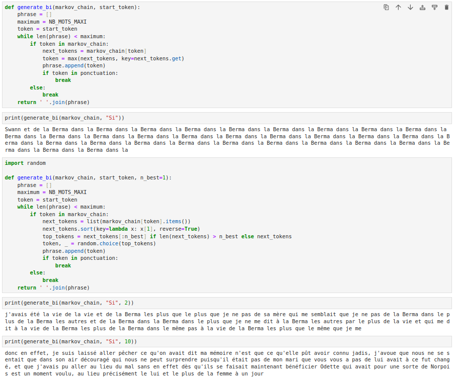

# TP4 : Génération de texte avec des chaînes de Markov

Rapport de TP réalisé par __Viet Nguyen -- 20006303__.

## Exercice 0 : préparer les données

## Exercice 1 : chaîne de Markov de premier ordre (unigrammes)

## Exercice 2 : chaîne de Markov d'ordre 2 (bigrammes)

Le resultat de l'exécution du code dans le fichier `exo_2.ipynb` est le suivant :

- **Ne pas utiliser `n_best`** : la sortie de la fonction qui n'utilise pas `n_best` entraîne la répétition de la même chaîne de mots "dans la Berma" plusieurs fois, créant ainsi une boucle qui ne se termine que lorsque la limite maximale de mots est atteinte. Cela se produit parce que le modèle choisit le mot suivant en fonction de la probabilité la plus élevée, sans aucune variété ; Si une certaine paire de mots (dans ce cas "la Berma") a une probabilité très élevée par rapport à d'autres paires, le modèle continuera à la choisir à chaque fois, ce qui entraînera une boucle.

- **Utilisation de `n_best` = 2** : Lorsque nous utilise `n_best` avec une valeur de 2, les résultats montrent plus de variété dans le choix du mot suivant, avec moins de répétitions et l'apparition de nouvelles séquences de mots. Cependant, il existe encore un taux de répétition important, ce qui montre que même si limiter le choix aux 2 premiers mots peut contribuer à augmenter la variété, cela ne suffit pas à empêcher complètement la répétition si le modèle privilégie toujours certains mots ou expressions.

- **En utilisant `n_best` = 10** : Avec une valeur `n_best` de 10, le résultat est une phrase avec une diversité significativement plus élevée que les deux cas précédents. Cela montre que permettre au modèle de considérer un plus grand nombre d'options potentielles pour choisir le mot suivant réduit considérablement la répétition et augmente la probabilité de générer un texte nouveau et plus riche.

En résumé, augmenter `n_best` améliore considérablement la variété et la fraîcheur du texte généré, minimisant ainsi les répétitions indésirables. Cependant, choisir une valeur `n_best` élevée peut également conduire à choisir des mots moins pertinents, réduisant ainsi la fluidité et la cohérence du texte. Par conséquent, il est nécessaire de trouver un équilibre entre la création d’un texte diversifié et le maintien d’une grande cohésion dans le texte.

## Exercice 3 : chaîne de Markov d'ordre arbitraire

