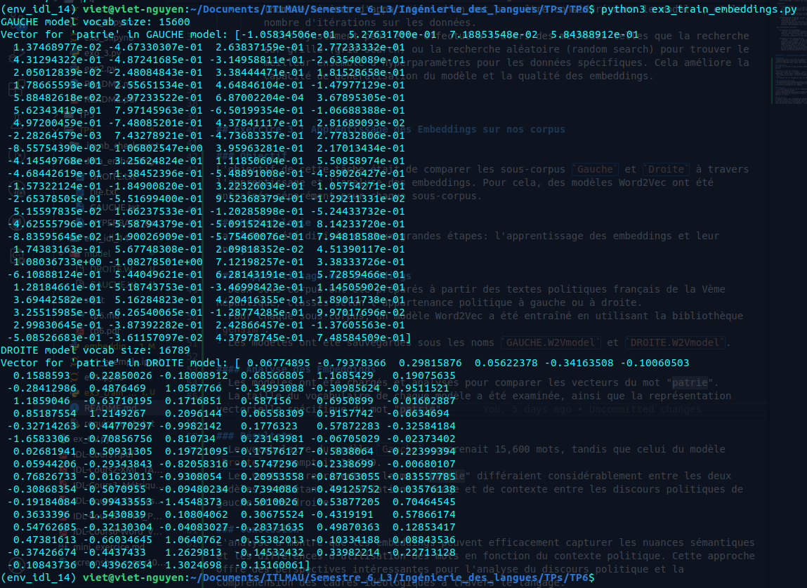

# IDL 14: Word Embeddings (`plongements lexicaux`)

Rapport de TP réalisé par __Viet Nguyen -- 20006303__.

## Exercice 1 : Constitution des sous-corpus

La lecture et la division des flux de données du fichier `HYPERBASE_Droite_VS_Gauche.txt` et l'impression des résultats dans deux fichiers `DROITE.txt` et `GAUCHE.txt` ont été effectuées dans le fichier `ex1.ipynb` à l'aide du jupyter notebook.


## Exercice 2 : Définition d'une classe `Embeddings`

 - Librairie et Modèle Utilisés :

	- Librairie Utilisée : `gensim`.
	- Modèle Spécifique : `Word2Vec` de la bibliothèque `gensim.models`.

- Limitations :

	- Prétraitement Simple :
		- La fonction `preprocess` se limite à supprimer la ponctuation et à convertir tous les caractères en minuscules, sans considérer d'autres étapes de prétraitement telles que la suppression des mots vides (stop words), le stemming ou la lemmatisation.
		- Ces étapes peuvent améliorer la qualité et la précision des embeddings en réduisant le bruit et le nombre de fonctionnalités non nécessaires.

	- Configuration Par Défaut de `Word2Vec` :
		- En utilisant la méthode `learn`, le modèle `Word2Vec` est initialisé avec ses paramètres par défaut.
		- Cela peut ne pas être idéal pour tous types de données. Par exemple, la taille des vecteurs (dimensionality) ou la taille de la fenêtre de contexte (window size) peut nécessiter des ajustements pour mieux refléter la nature des données utilisées.

- Deux Améliorations Possibles :

	- Amélioration du Prétraitement :
		- Intégrer une étape de prétraitement plus complète incluant la suppression des mots vides et l'application de stemming ou de lemmatisation.
		- Cela aide à épuré le texte et à se concentrer sur le contenu important, réduisant la taille du vocabulaire et améliorant la performance du modèle.

	- Ajustement Fin des Hyperparamètres :
		- Procéder à un ajustement fin des hyperparamètres du modèle `Word2Vec`, incluant la taille du vecteur (size), la taille de la fenêtre de contexte (window), le min_count (nombre minimum d'apparitions d'un mot pour être considéré dans le modèle), et le nombre d'itérations sur les données.
		- Cet ajustement peut être effectué à travers des méthodes telles que la recherche sur grille (grid search) ou la recherche aléatoire (random search) pour trouver le meilleur ensemble d'hyperparamètres pour les données spécifiques. Cela améliore la capacité de généralisation du modèle et la qualité des embeddings.


## Exercice 3 : Apprentissage des Embeddings sur nos corpus

1) **Objectif**
L'objectif de cette tâche était de comparer les sous-corpus `Gauche` et `Droite` à travers l'apprentissage et l'analyse des embeddings. Pour cela, des modèles Word2Vec ont été entraînés séparément pour chaque sous-corpus.

2) **Méthodologie**
La tâche a été divisée en deux grandes étapes: l'apprentissage des embeddings et leur analyse.

- Apprentissage des Embeddings
  - Deux sous-corpus ont été préparés à partir des textes politiques français de la Vème République, classés selon l'appartenance politique à gauche ou à droite.
  - Pour chaque sous-corpus, un modèle Word2Vec a été entraîné en utilisant la bibliothèque `gensim`.
  - Les modèles ont été sauvegardés sous les noms `GAUCHE.W2Vmodel` et `DROITE.W2Vmodel`.

- Analyse des Embeddings
  - Les modèles ont été chargés et analysés pour comparer les vecteurs du mot "patrie".
  - La taille du vocabulaire de chaque modèle a été examinée, ainsi que la représentation vectorielle spécifique du mot "patrie".

3) **Résultats**

- Le vocabulaire du modèle `Gauche` comprenait 15,600 mots, tandis que celui du modèle `Droite` en comptait 16,789.
- Les vecteurs représentant le mot "patrie" différaient considérablement entre les deux modèles, reflétant les variations d'usage et de contexte entre les discours politiques de gauche et de droite.

4) **Conclusion**
L'analyse a montré que les embeddings peuvent efficacement capturer les nuances sémantiques et les différences d'utilisation des mots en fonction du contexte politique. Cette approche offre des perspectives intéressantes pour l'analyse du discours politique et la compréhension des cadres idéologiques à travers le langage.


## Exercice 4 : Utilisation des Embeddings

1. **Objectif**
   - Exploration des similarités et des différences entre les mots des sous-corpus `Gauche` et `Droite` à travers l'utilisation d'embeddings.

2. **Méthodologie**

- Chargement des Modèles
   - Deux modèles pré-entraînés, `GAUCHE.W2Vmodel` et `DROITE.W2Vmodel`, ont été chargés pour l'analyse.

```python
embeddings_gauche = Embeddings(gauche_corpus_path, gauche_model_path)
embeddings_droite = Embeddings(droite_corpus_path, droite_model_path)
embeddings_gauche.load()
embeddings_droite.load()
```

- Analyse de Similarité Cosinus

	La similarité cosinus entre les vecteurs de mots présents dans les deux modèles a été calculée pour identifier les mots les plus proches et les plus éloignés.

```python
for word in vocab1.intersection(vocab2): 
    vec1 = emb1.wv.get_vector(word)
    vec2 = emb2.wv.get_vector(word)
    sims[word] = cosine_similarity(vec1, vec2)
```

- La méthode tsne

	- Avant d'appliquer T-SNE, PCA a été utilisé pour réduire le nombre de dimensions des vecteurs de mots à 50. Cette étape préalable a permis d'accélérer le processus de T-SNE tout en conservant les informations essentielles des vecteurs.
   
	- T-SNE a ensuite été appliqué sur les vecteurs réduits par PCA pour les projeter dans un espace bidimensionnel.

```python
from sklearn.decomposition import PCA
from sklearn.manifold import TSNE
import matplotlib.pyplot as plt
import numpy as np

pca_model = PCA(n_components=50)
vectors_pca = pca_model.fit_transform(vectors_np)

tsne_model = TSNE(n_components=2, random_state=0)
vectors_2d = tsne_model.fit_transform(vectors_pca)

plt.figure(figsize=(10,10))
for i, label in enumerate(labels[:200]):
	x, y = vectors_2d[i]
	plt.scatter(x, y)
	plt.annotate(label, xy=(x, y), textcoords='offset points', ha='right', va='bottom')
plt.show()
```
La visualisation a révélé des groupes de mots similaires qui sont regroupés ensemble dans l'espace vectoriel, illustrant la capacité des embeddings à capturer des relations sémantiques entre les mots.

L'utilisation préalable de PCA avant T-SNE a été cruciale pour accélérer le processus de réduction de dimensionnalité, permettant une visualisation efficace même sur des ensembles de données volumineux.

Cette étape a démontré l'importance de la visualisation dans l'analyse des embeddings, offrant une compréhension plus profonde de la manière dont les mots sont représentés et associés dans les modèles de langue.

1. **Résultats et Interprétations**

```bash
$ python3 ex4_use_embeddings.py 
*** Vecteurs proches :
massifs: 0.719204843044281
harmonieusement: 0.7095640301704407
coordonnées: 0.7069694399833679
inhumaines: 0.7036724090576172
pétrolières: 0.7000871300697327
multipliés: 0.6989722847938538
recherchées: 0.6934378743171692
interviendra: 0.6926162838935852
88deputees: 0.6918997764587402
optiques: 0.6877894997596741
revalorisée: 0.6848880648612976
apportées: 0.6831735372543335
réguliers: 0.6814786195755005
pharmaceutiques: 0.6790385246276855
modérateur: 0.6771036982536316
pourchassés: 0.675208568572998
nous: 0.6734163165092468
législatifs: 0.6725414991378784
atteints: 0.6708149313926697
voyageurs: 0.6700950860977173
condamnent: 0.6689863801002502
rationnelle: 0.6611851453781128
résultera: 0.660872220993042
instituant: 0.6604918241500854
abusifs: 0.6580160856246948
soulève: 0.6558845639228821
publicitaire: 0.6552891731262207
laborieuses: 0.6540619134902954
via: 0.6535336971282959
doublée: 0.6518656611442566

*** Vecteurs éloignés :
demie: -0.0775613933801651
confrères: -0.07946539670228958
mi: -0.08098825812339783
assumerai: -0.08145415037870407
travailleurs: -0.08223634958267212
digne: -0.08435717970132828
fallu: -0.086612768471241
dossiers: -0.08708828687667847
presque: -0.09097281098365784
air: -0.09268412739038467
chaque: -0.09316659718751907
ce: -0.09381794929504395
ouverture: -0.09488913416862488
souvent: -0.09515020996332169
aubaine: -0.09567276388406754
parents: -0.09592410922050476
membres: -0.09615166485309601
périodes: -0.09618326276540756
engager: -0.09771560877561569
disparu: -0.10373591631650925
fonctionnaires: -0.10524016618728638
ecologie: -0.108995221555233
textes: -0.10971301048994064
réunionnais: -0.1101052537560463
travaux: -0.11542480438947678
chez: -0.12326614558696747
citoyens: -0.12610822916030884
cuisine: -0.13526451587677002
yeux: -0.1359660029411316
sarkozy: -0.13873465359210968

Analysing word: gauche

Top 10 similar words in GAUCHE:
gauche	(GAUCHE)	droite majorité socialiste victoire force rassembler changement socialistes division réaction

Top 10 similar words in DROITE:
gauche	(DROITE)	droite extrême républicaine communiste socialiste plurielle idéologie coalition jaurès parti

Analysing word: droite

Top 10 similar words in GAUCHE:
droite	(GAUCHE)	gauche réaction haine extrême division majorité violence défaite sarkozy dispersion

Top 10 similar words in DROITE:
droite	(DROITE)	gauche républicaine extrême parti communiste droite08 caviar parti3 plurielle socialo

Analysing word: homme

Top 10 similar words in GAUCHE:
homme	(GAUCHE)	citoyen journaliste expression femme supplément organisme amour quelqu individu acte

Top 10 similar words in DROITE:
homme	(DROITE)	individu enfant amour élève quelqu citoyen responsable expression auteur honneur

Analysing word: action

Top 10 similar words in GAUCHE:
action	(GAUCHE)	intervention unité expérience engagement ambition intelligence élaboration opinion initiative identité

Top 10 similar words in DROITE:
action	(DROITE)	efficacité ambition attitude équipe administration expérience intervention démarche utilité adhésion

Analysing analogy: président + femme - homme

GAUCHE:
présidence	0.7130591869354248
députée	0.6334124207496643
visite	0.6034387350082397
élue	0.5986571907997131
sixième	0.5913235545158386

DROITE:
visite	0.6516299247741699
présidente	0.6356360912322998
présidence	0.5914791822433472
députée	0.5607599020004272
nomination	0.557327926158905

Analysing analogy: candidat + femme - homme

GAUCHE:
candidate	0.8010777831077576
députée	0.6859909296035767
candidature	0.6453840136528015
désignation	0.6122894883155823
voix	0.6121416687965393

DROITE:
candidate	0.6536280512809753
visite	0.6511512994766235
nomination	0.6169627904891968
candidature	0.5873185992240906
députée	0.582665205001831

Analysing analogy: député + candidats - candidat

GAUCHE:
suffrages	0.800247311592102
députés	0.7148987650871277
parlementaires	0.6887451410293579
élus	0.6669000387191772
présidents	0.6613858938217163

DROITE:
assemblées	0.6285987496376038
présidents	0.6257114410400391
ministres	0.6254886984825134
personnalités	0.6113936901092529
instants	0.6004646420478821

```

- Vecteurs Proches et Éloignés

	Des mots tels que "massifs" et "harmonieusement" ont montré une grande proximité entre les deux sous-corpus, indiquant des usages similaires.
	À l'inverse, des mots comme "demie" et "confrères" ont révélé des similarités faibles, suggérant des différences dans l'usage ou la connotation.

- Observation de Vecteurs Similaires

	Pour des mots clés tels que "gauche", "droite", "homme", et "action", les 10 mots les plus similaires ont été extraits de chaque modèle.
```python
words_to_explore = ["gauche", "droite", "homme", "action"]
for word in words_to_explore:
    similar_words = emb.most_similar(word, topN=10)
```

- Analogies

	Les analogies telles que "président + femme - homme" ont été explorées pour comprendre comment les relations entre mots sont représentées.
```python
pos, neg = ['président', 'femme'], ['homme']
analogy_result = emb.most_similar_analogy(pos, neg, topN=5)
```

4. **Conclusion**

L'analyse a permis de mettre en évidence la capacité des embeddings à capturer des nuances sémantiques subtiles entre les mots dans des contextes politiques variés. Elle a aussi démontré le potentiel des embeddings pour l'étude comparative de discours politiques à travers des analyses de similarité et d'analogie.


