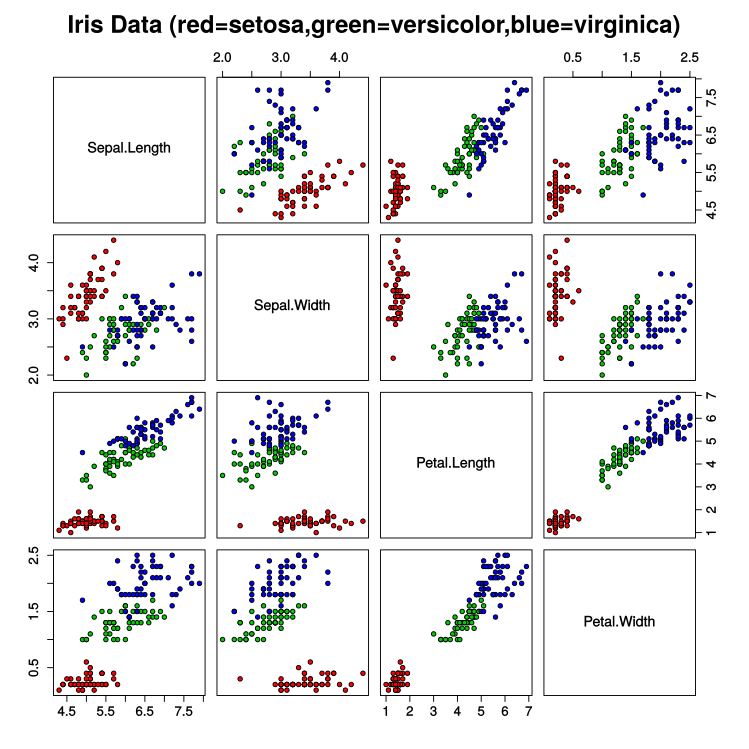
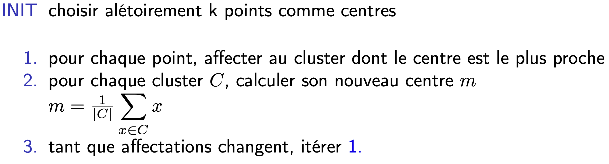
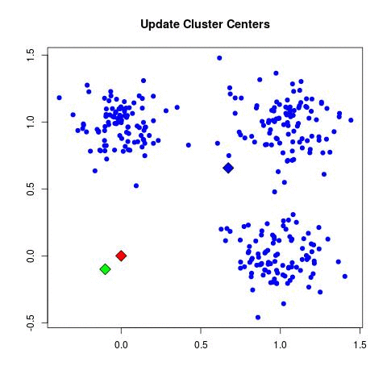
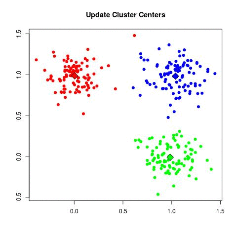

# TP1: k-moyennes fleuries

Il s'agit d'implémenter l'algorithme des k-moyennes à une base de données classique en apprentissage automatique : les iris. La base de données des iris est présentée ci-dessous, puis le travail est décrit. Enfin, l'algorithme est rappelé.

## Les iris (150 données)

### Classes :

Iris setosa

Iris versicolor

Iris virginica

### Attributs :
Longueur des sépales
Largeur des sépales
Longueur des pétales
Largeur des pétales

**SÉPALE**, subst. masc. (https://cnrtl.fr/definition/sépale)

**BOT**. Chacun des éléments foliacés, généralement verts, dont la réunion compose le calice et supporte la corolle de la fleur.

**PÉTALE**, subst. masc. (https://cnrtl.fr/definition/pétale)

**A. − BOT**. Chacun des éléments foliacés, généralement colorés, qui composent la corolle d'une fleur.

### Répartition de la population, selon les attributs fournis :

image/image tirée de https://en.wikipedia.org/wiki/Iris_flower_data_set

## k-moyennes et iris 

Le programme devra :

1 - Prendre en entrée deux fichiers, inclus dans l'archive **iris/** :

- iris_data

- iris_label

Le fichier iris_data est composé d'une donnée par ligne sous la forme :

5.0;3.3;1.4;0.2;
7.0;3.2;4.7;1.4;
6.5;3.2;5.1;2.0;

Le fichier label a le même nombre de lignes que le fichier data, chaque ligne indiquant la classe de la ligne correspondante dans le fichier data. Avec :

- 0 désigne la classe des iris setosa

- 1 désigne la classe des iris versicolor

- 2 désigne la classe des iris virginica

2 - Programmer, en python, l'algorithme des k-moyennes, de manière à pouvoir l'appliquer à différents jeux de données.

3 - Appliquer l'algorithme aux iris, en faisant varier la valeur de k (i.e. le nombre de clusters) et donnez le k minimal permettant d'obtenir des clusters contenant un unique type d'iris. Les classes (fichier label) seront utilisées pour vérifier la "pureté" des clusters. 

4 - Tester son implémentation sur les clusters gaussiens fournis dans le fichier clusters.py joint (sans utiliser les centres comme centroîdes). Comparer les résultats pour 2 à 6 clusters, que vous pourrez éloigner, rapprocher ou étendre (en taille).

### Rappel de l'algorithme des k-moyennes

Le déroulement de l'algorithme est sur le principe suivant :

image/image tirée de https://mubaris.com/posts/kmeans-clustering/

